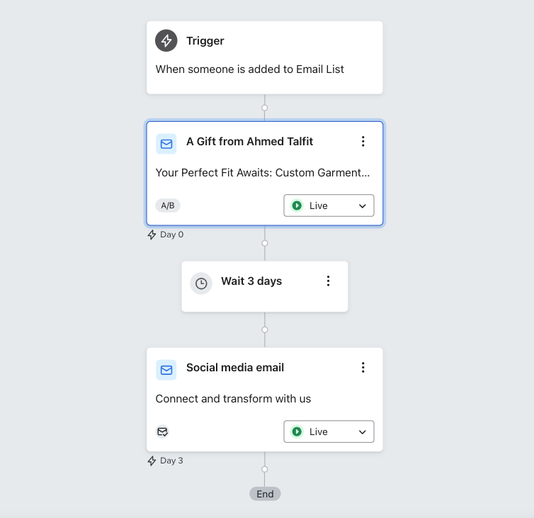

## 🎩 Bespoke Fashion Lead Conversion & Client Reactivation
*Turning high-intent website visitors and past buyers into booked consultations*

**Client:** Ahmed Talfit — Custom Luxury Fashion House  
**Objective:** Convert high-intent website visitors and past clients into consultation requests and repeat commissions through personalized retargeting and email automation.

---

### 1. The Challenge

The brand attracted strong website engagement on its lookbook and bespoke service pages — but few visitors converted into consultation requests. Past clients showed high lifetime value but low reactivation. Previous outreach was generic and didn’t match the brand’s tailored, concierge-level experience, resulting in lost revenue opportunities.

---

### 2. Strategy - Intent-Based Retargeting & Personalized Follow-Up

**Target Audiences**
- **Browsers:** Viewed key garments or fabric pages without inquiring  
- **Past Clients:** Segmented by previous order history
- **High-Intent Prospects:** Multiple visits or extended session time

**Channels & Tools**    
Meta Ads · Meta Pixel · Klaviyo Automated Flows · GA4 · Looker Studio

**Methods**  
Dynamic retargeting · A/B-tested creatives & offer framing · Email flows for new, returning, and high-value segments

---

### 3. Execution

- Built Meta retargeting audiences mapped to onsite behavior and visit frequency  
- Designed automated email sequences using a personal stylist–style tone (style advice, new material previews, invitation-only fittings)
- Unified messaging across ads and email for consistent positioning  
- Optimized campaigns weekly based on inquiry click-through and segment performance

---

### 📩 Email Automation Flow

<em>Automated Klaviyo sequence used to nurture high-intent subscribers and re-engage past clients. Each stage reflects a tailored touchpoint in the luxury client journey.</em> 

---

### 4. Results & Impact

- **+36% increase in consultation inquiries within 3 months**  
- **+30% uplift in repeat commissions from past buyers**  
- **3× ROI on campaign spend** through refined audience targeting  
- **21%+ average CTR** across personalized email sequences

---

### 5. Key Insight

In luxury, recognition outperforms incentives. Personalized follow-up converts better than discounts.
